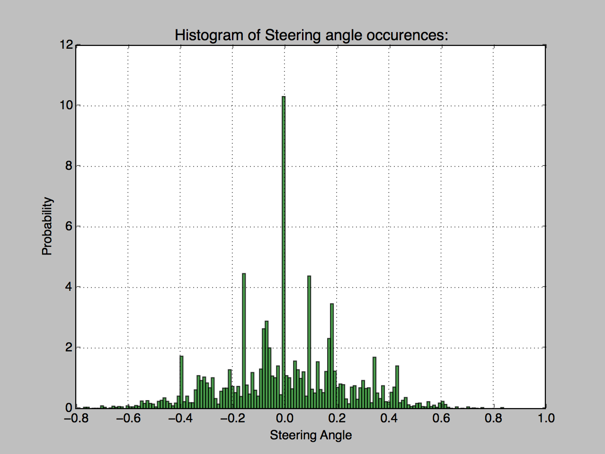
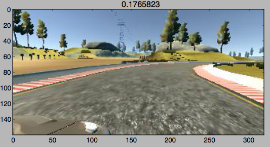
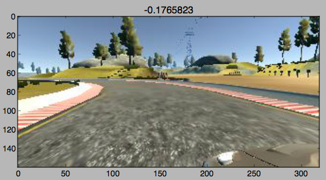
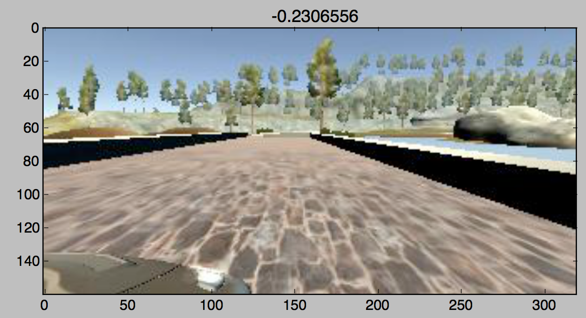
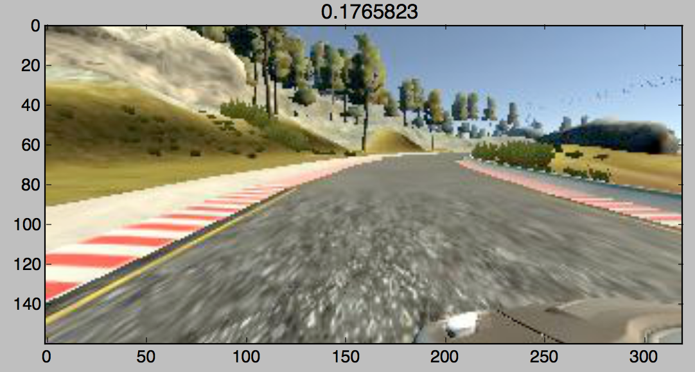
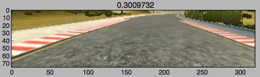
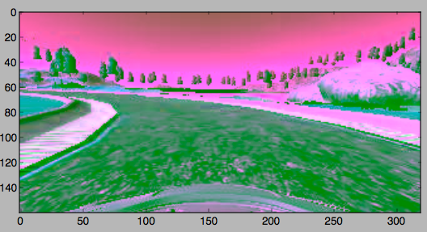

# car-magic
## Behavioural Cloning Project 
#### Udacity Self-Driving Car Engineer Nanodegree
The car drives itself, it's almost magic! After a lot of training and testing, the car can successfully maneouver around the track without crashing. This repository contains all code used to train the model to predict steering angles when given an image taken by the car's center camera.

## How it Works

First, lots of data has to be generated by having a human drive the car around a simulated track. From here, the car learns how to steer by modelling how the human responded to the varying bends and terrain. 

The model is a Convolution Neural Network that takes in an image and predicts a steering angle to try stay on the track.

An image from the simulator is passed into the trained model and a steering angle is then sent to the car to steer around the track.

## Network Structure

The network architecture was based off the [NVIDIA model](http://images.nvidia.com/content/tegra/automotive/images/2016/solutions/pdf/end-to-end-dl-using-px.pdf) used to train a real-life self drivng car. This model uses regression to determine the steering angle.

This consists of many convolution layers, normalization, dropouts and several fully connected layers. 

Dropout was used to stop the model from overfitting the data.

Elu was chosen for activation through experimentation. Tanh and relu were tried out but Elu seemed to provide slightly better results.

An Adam optimiser was used to optimise the model for small loss by means of mean squared error. This was chosen as it is best suited for regression models.

The final structure was determined through MANY trial and error runs and continuously iterated and improved upon. 

The layout was as follows:

Layer Type | Description
---------- | -----------
Normalization Layer | Normalizes pixel values between -0.5 and +0.5
2D Convolution Layer 1 | 5x5 kernal, 2x2 stride, depth of 24, elu activation
2D Spatial Dropout | 0.5 probability of drop 
2D Convolution Layer 2 | 5x5 kernal, 2x2 stride, depth of 36, elu activation
2D Spatial Dropout | 0.5 probability of drop 
2D Convolution Layer 3 | 5x5 kernal, 2x2 stride, depth of 48, elu activation
2D Spatial Dropout | 0.5 probability of drop 
2D Convolution Layer 4 | 3x3 kernal, 1x1 stride, depth of 64, elu activation
2D Spatial Dropout | 0.5 probability of drop 
2D Convolution Layer 5 | 3x3 kernal, 1x1 stride, depth of 64, elu activation
2D Spatial Dropout | 0.5 probability of drop 
Flatten Layer | 
Fully Connected Layer | 100 neurons
Dropout | 0.5 probability of drop 
Fully Connected Layer | 50 neurons
Dropout | 0.5 probability of drop 
Fully Connected Layer | 10 neurons 
Dropout | 0.5 probability of drop 	 
Fully Connected Layer | 1 neuron 	
Adam Optimiser | Mean squared error for loss function

## Training Data

The initial training data was the dataset provided by Udacity and then further fine-tuning was done on the simulator with an Xbox controller.

The original dataset had only about 23k images and many of those were close to 0 steering angles. In order to generate a good model, the data had to be augmented to increase sample size as well as normalised to maximise performance of the model.

### Data Normalisation 

There are more straight road on the training track than curves. Therefore with no normalization, the car would become biased towards driving straight and head straight into the lake! 

The data was normalized by dropping low angles with a specified probability. 

This resulted in the following histogram:

The data appears to be nicely normally distributed with not too many close-to zero angles. 

### Generating Data

Data augmentation was used to generate more data without having to drive around the same track over and over again. The following techniques were used:

#### Flipping Images

We can simply flip the images along the vertical axis to give us a new perspective. With this, the angle associated with the image has to me mutliplied by -1.

Before Flip:

 

After Flip:

 

As you can see, the curve changes from a right corner to a left corner and the angle becomes negative.

#### Using Left and Right Camera Images

There are three caermas on the car, left, right and center. Initially only the center images were used, and then to get more data, the right and left images were included. This helped to steer the car away from the edges of the track as the angle was adjusted to bring the car back to the center. 

Right image:
 

Left image:

 

### Data Augmentation

To help better regularize the model to deal with different situations, augmentation was done. This involved the following:

#### Cropping Images

Most of the camera image contains irrelevant information such as the background and the hood of the car. Therefore, to ensure the model learns only the road and to reduce the number of parameters, the image was cropped.

Example of a cropped image:

 
 
 
#### Changing to YUV

As per the NVIDIA model, the images were converted from RGB to YUV. This helped to not let the model learn from specfic colours of the images.

YUV converted image:

 
 
## Final Result

The end result ended up being very good. Only some fine tuning around difficult corners and across the bridge was necessary. The car was able to recover itself when it started drifting off to the side. However, a lot of work would need to be done before a huan would feel comfortable getting inside this car!